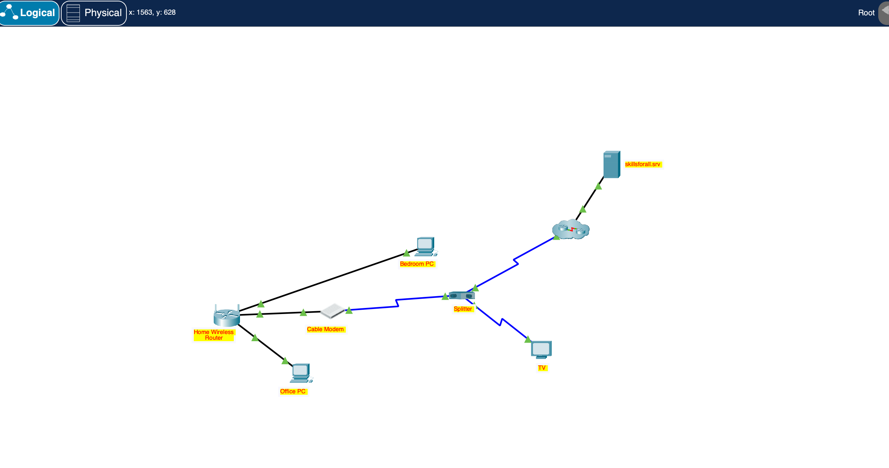
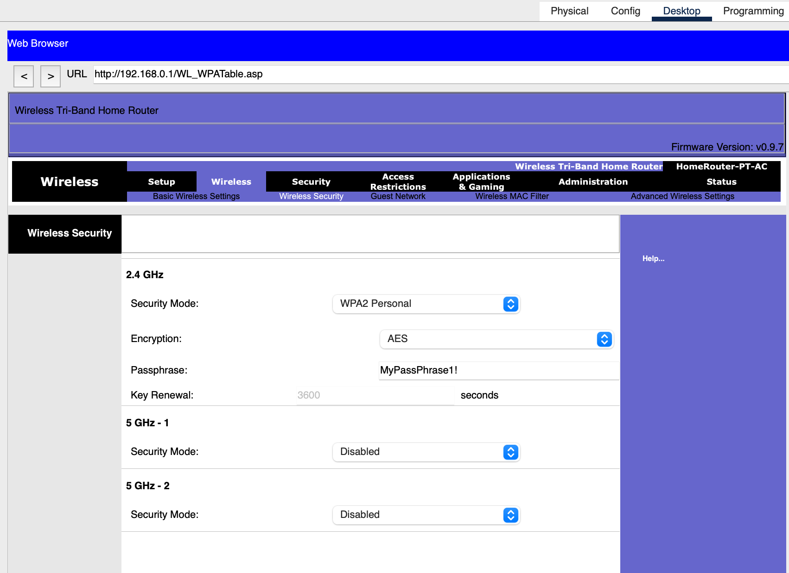
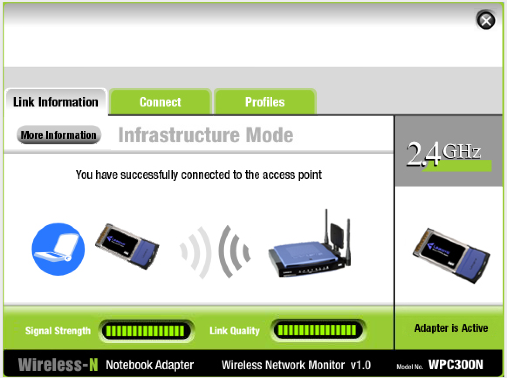

# Home Wireless Router Configuration

**Cisco Packet Tracer Lab**

## Objective

Design and configure a small residential network end-to-end: bring internet and TV service in over coax, wire two desktop PCs into a SOHO wireless router, stand up a secured Wi-Fi network for a laptop, and verify that every device — wired and wireless — actually reaches the internet.

## Topology

*Logical view after all devices were connected and configured.*

- **ISP feed** → coax splitter → Cable Modem (data) + TV (video)
- **Cable Modem** → Internet port on the Home Wireless Router (copper straight-through)
- **Office PC** → Router `GigabitEthernet1` (wired)
- **Bedroom PC** → Router `GigabitEthernet2` (wired)
- **Laptop** → 2.4 GHz Wi-Fi

## What I configured

**1. Physical connectivity**
Split the incoming coax feed to the cable modem and the TV, then ran a copper straight-through cable from the modem to the router's Internet port, and from the router's LAN ports to each desktop PC.

**2. Router access & hardening**
Logged into the router's web-based GUI using the factory-default credentials, then immediately replaced the default admin password — a reminder that default credentials on real consumer hardware are public knowledge and an easy attack vector.

**3. DHCP scope sizing**
Reduced the DHCP pool to a maximum of 10 addresses to match the household's realistic device count, tightening the network slightly given the building's dense surroundings.

**4. Wireless network & security**
Enabled the 2.4 GHz radio, set a custom SSID, and secured it with WPA2-Personal (the strongest option this router offers) plus a custom pre-shared key, since the signal would reach beyond the apartment itself.

**5. Client configuration & verification**
Configured DHCP on both wired PCs and the laptop, connected the laptop to the new SSID with the pre-shared key, and confirmed internet access from all three endpoints by loading an external site.

## Skills demonstrated

- SOHO router configuration through a web GUI
- DHCP server setup and lease-pool sizing
- WPA2-Personal wireless security configuration
- Basic device hardening (default-credential rotation)
- Coax / Ethernet cabling and physical topology design
- Client-side IP configuration (DHCP) on wired and wireless hosts
- End-to-end connectivity verification

## Tools

Cisco Packet Tracer

## Notes

A good reminder of how much a single consumer router quietly handles — routing, DHCP, Wi-Fi access point, and basic admin controls — and why rotating default credentials matters even outside enterprise networks.
